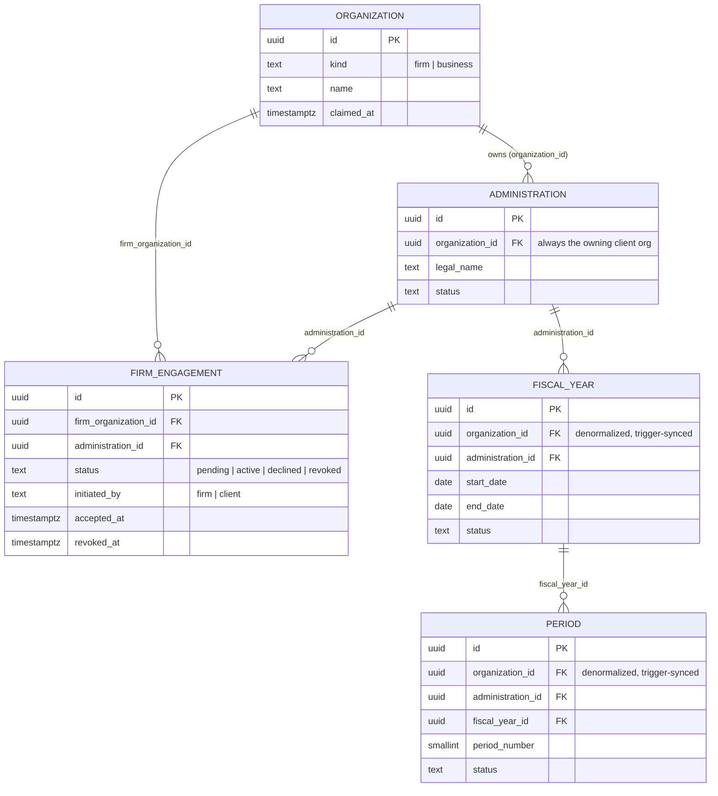

# ADR-002: Tenancy schema — Organization, Administration, firm access, FiscalYear, Period

- **Status**: Accepted (RLS policy detail superseded by [ADR-003](ADR-003-rls-enforcement.md))
- **Date**: 2026-08-19

## Context

PRD §8.1 defines the tenancy tree (`Organization → Administration → FiscalYear → Period`) and
requires it to satisfy IAM-001 through IAM-005 — tenant predicate on every record, isolation
enforced at the data layer, cross-tenant access impossible by design via explicit grants, and
per-endpoint isolation tests. PRD §5.1 requires both account models — firm-led (Model A) and
self-managed (Model B) — to ship in P0 as *one* product underneath (FR-MDL-001 through
FR-MDL-010), not two implementations that happen to look similar.

The schema needed to answer one specific design question: how does a firm organization hold or
reach a client administration it doesn't own, in a way that's the same tables for both models,
and that a query can't accidentally bypass.

## Decision

- `organization.organization_id` on `administration` is **always the owning/client
  organization** — never a firm, in either account model. Model A and Model B are not two code
  paths; a self-managed business's own org owns its administration directly, and a firm-created
  client (FR-MDL-004) gets a real (if unclaimed) client `organization` row that owns it too.
- A firm's reach into a client administration is represented by exactly one relationship table,
  `firm_engagement` (firm_organization_id, administration_id, status, initiated_by, acceptance/
  revocation actors and timestamps). This is the only path by which a firm can touch an
  administration it doesn't own — there is no second, implicit route.
- `organization_id` is denormalized onto `fiscal_year` and `period`, kept in sync by a
  `BEFORE INSERT/UPDATE` trigger derived from the row's parent, so the column can never drift
  from the administration it belongs to.
- Row-level security is enabled and forced (`FORCE ROW LEVEL SECURITY`) on every tenant-scoped
  table, with per-operation (SELECT/INSERT/UPDATE) policies built on two shared predicate
  functions rather than one ad hoc check per table. See [ADR-003](ADR-003-rls-enforcement.md)
  for the full mechanism — roles, the session variable, and how row creation is bootstrapped
  before any tenant context exists to check against.
- `app.current_org_id` (a Postgres session/transaction setting) is the only input to that
  function. If middleware fails to set it, every RLS check compares against `NULL` and denies —
  the tenant-context-missing failure mode is "see nothing," matching CLAUDE.md's non-negotiable
  #3 (fail closed), not "see everything."

Full schema: [apps/api/migrations/0001_tenancy_core.sql](../../apps/api/migrations/0001_tenancy_core.sql).

`FIRM_ENGAGEMENT` is the only edge connecting a firm's `ORGANIZATION` row to an `ADMINISTRATION`
it doesn't own — there is no FK from `ADMINISTRATION` to a firm. Ownership (solid, one edge) and
access (a separate table, independently revocable) are deliberately not the same relationship.

## Alternatives considered

| Option | Rejected because |
|---|---|
| Two schemas/paths — a `client_administration` table for Model A, a plain `administration` for Model B | Directly contradicts "both account models must be the same tables, not two paths." Would also double the isolation-test surface for IAM-005 and create a seam where the two paths could silently diverge in behavior. |
| Firm access via `administration.organization_id` pointing at the firm directly (i.e., firm "owns" client administrations it manages) | Makes FR-MDL-005 ("a firm never gains access to an existing administration without the client's acceptance") and FR-MDL-009 (client can revoke without the firm's cooperation, and always retains underlying rights) awkward to express — ownership and access would be conflated, and revocation would require reassigning ownership rather than deleting a grant. Also breaks FR-MDL-008: hand-back between firm and self-managed would require rewriting `organization_id` on every downstream posting instead of nothing. |
| Access represented only via per-user `RoleAssignment` rows (already in PRD §15), no org-level `firm_engagement` table | `RoleAssignment` is the right place for *individual* firm staff grants (FR-FRM-004) but has no natural home for the org-level facts FR-MDL-005/007/009 require: who initiated the engagement, whether the client accepted, and revoking the whole firm's access in one action rather than one row per staff member. |
| Schema-per-tenant or database-per-tenant isolation instead of RLS | IAM-002 specifically calls out "PostgreSQL row-level security or equivalent" enforced at the data layer; schema-per-tenant would also make a firm's cross-administration portfolio queries (FR-FRM-001, FR-FRM-002) require fan-out across schemas instead of one filtered query. |
| Leave `organization_id` on `fiscal_year`/`period` to be derived via join at query time, no denormalized column | IAM-001 literally requires the tenant predicate to be on the record. A join-only approach also means every new query site has to remember to join correctly; the denormalized, trigger-synced column can't be forgotten or gotten wrong. |

## Consequences

- Ownership transfer (FR-MDL-008, hand firm ↔ self-managed) is a single `UPDATE
  administration.organization_id`, logged through the existing `AuditEvent` trail (PRD §15) —
  no data migration, matching the requirement's own wording.
- Revoking a firm's access (FR-MDL-009) is one `UPDATE firm_engagement SET status = 'revoked'`;
  RLS means the administration disappears from that firm's queries on the very next request,
  with no cache or secondary flag to also update.
- `app.has_administration_access` becomes the one place tenant-isolation tests (IAM-005) need to
  exhaustively cover; any future tenant-scoped table just adds an RLS policy calling the same
  function rather than inventing new logic.
- Not covered by this migration, deferred to follow-on ADRs/migrations: the `client_access_profile`
  mechanism from §8.6 (IAM-100+) that scopes *what* a client's users can do once a
  `firm_engagement` is active, and per-tenant document encryption keys (IAM-004). Those attach to
  `firm_engagement`/`administration` respectively without changing the shape decided here.
